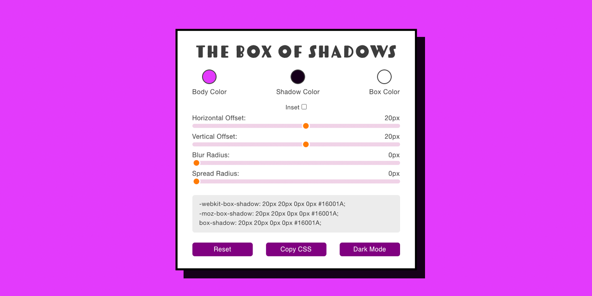
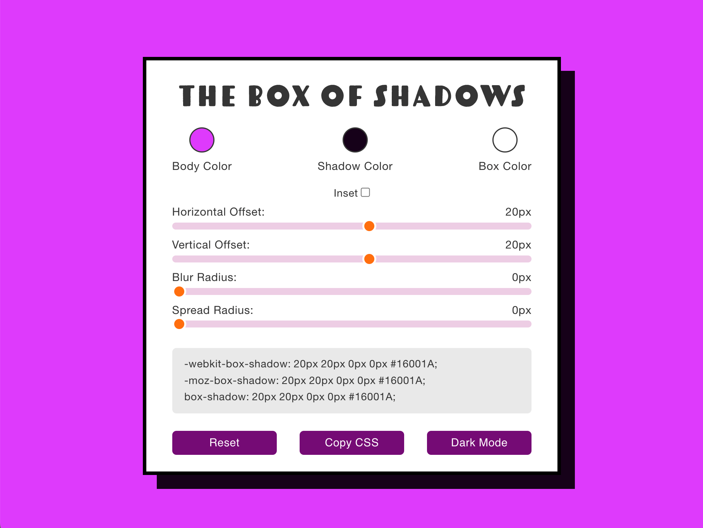
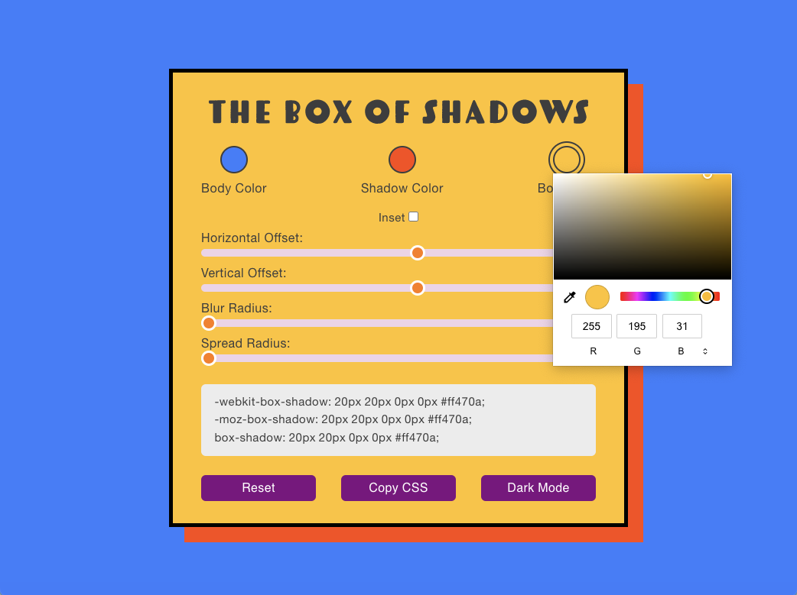

<p id="header"><p>

<table>
    <tr>
        <td><a href="https://github.com/emjose/eye-onic-reading/#header"></a></td>
        <td><a href="https://github.com/emjose/one-hundred/#header"></a></td>
        <td><a href="https://github.com/emjose/box-of-shadows/#header"></a></td>
        <!-- <td><a href="https://github.com/emjose/****NEXT-REPO****/#header"></a></td> -->
    </tr>
</table>

<br>

<p id="project-title"><p>

<a href=#table-of-contents></a>

<br>

<a href="https://box-of-shadows.vercel.app/"></a>

#

<p id="table-of-contents"><p>

<a href=#table-of-contents></a>

-   [100 Days of Code](#100days)
-   [Installation](#installation)
-   [Live Site](#live-site)
-   [Improvement](#improvement)
-   [Resources](#resources)
-   [Let's Connect!](#lets-connect)

<br>

#

<p id="100days"><p>

<a href=#100days></a>

### Day 38: October 3, 2022

-   The **[The Box of Shadows](https://box-of-shadows.vercel.app/)** is a CSS box shadow generator, adapted from two tutorials:

    -   [Box Shadow Generator](https://youtu.be/9WZ4ajDNmrU)

    -   [JavaScript 30: CSS Variables](https://youtu.be/0pGnaanQNF8)

-   Together, the lessons taught me about the efficacy of [CSS variables](https://css-tricks.com/difference-between-types-of-css-variables/) and [HTMLElement datasets](https://developer.mozilla.org/en-US/docs/Web/API/HTMLElement/dataset) in dynamically rendering elements with JavaScript.

-   Functionality was extended with the following:

    -   [Clipboard.js](https://clipboardjs.com/) implementation

    -   Accessibility and installability as a [progressive web app](https://developer.mozilla.org/en-US/docs/Web/Progressive_web_apps)

    -   Ability to change theme, multiple color inputs, and reset code

<br>

#

<p id="installation"><p>

<a href=#installation></a>

#### 1. Git clone and cd into the repo folder:

```console
git clone git@github.com:emjose/box-of-shadows.git && cd box-of-shadows
```

#### 2. Run the command:

```console
open index.html
```

<br>

#

<p id="live-site"><p>

<a href="https://box-of-shadows.vercel.app/"></a>

<a href="https://box-of-shadows.vercel.app/"></a>

• **[The Box of Shadows](https://box-of-shadows.vercel.app/)** is best viewed on a destop or laptop computer browser.

• **[The Box of Shadows](https://box-of-shadows.vercel.app/)** can be viewed on mobile devices, but large shadow values will be cropped.

• **[The Box of Shadows](https://box-of-shadows.vercel.app/)** is a responsive and [progressive web app](https://developer.mozilla.org/en-US/docs/Web/Progressive_web_apps).

<a href=#live-site></a>

<details>
<summary><b>GIF demo: Changing Shadow Values</b></summary>
<br>

<a href="https://box-of-shadows.vercel.app/"></a>

Users can change values for horizontal and vertical offset, as well as blur and spread radius.

#

</details>

<details>
<summary><b>GIF demo: Changing Color Values</b></summary>
<br>

<a href="https://box-of-shadows.vercel.app/"></a>

Body, shadow, or box color can be changed. The color picker is not visible in the GIF, see image below.

<a href="https://box-of-shadows.vercel.app/"></a>

#

</details>

<details>
<summary><b>GIF demo: Copying and Resetting</b></summary>
<br>

<a href="https://box-of-shadows.vercel.app/"></a>

• The `box-shadow` CSS code can be copied to the clipboard, with [vendor prefixes](https://developer.mozilla.org/en-US/docs/Glossary/Vendor_Prefix) for common browsers.

• Shadow and color settings can be reset to default values for either light or dark mode.

#

</details>

<details>
<summary><b>GIF demo: Light or Dark Mode</b></summary>
<br>

<a href="https://box-of-shadows.vercel.app/"></a>

Users can switch between light or dark mode, with preference saved to local storage.

#

</details>

<details>
<summary><b>GIF demo: Accessibility</b></summary>
<br>

<a href="https://box-of-shadows.vercel.app/"></a>

• **[The Box of Shadows](https://box-of-shadows.vercel.app/)** is keyboard-navigable.

• For keyboard navigation, the inset checkbox can be checked or unchecked by pressing the `space` key.

</details>

<br>

#

<p id="improvement"><p>

<a href=#improvement></a>

**There are a number of areas of improvement for [The Box of Shadows](https://box-of-shadows.vercel.app/):**

-   Option for box shadow opacity.

-   Option for multiple box shadow layers.

-   Option to copy CSS lines for body or box color properties.

-   Custom shadow values persisting on refresh, and persisting between light and dark modes.

-   Maintain automatic contrast and legibility for text, buttons, and slider ranges when box color is changed.

<br>

#

<p id="resources"><p>

<a href=#resources></a>

-   #### [Cloudinary](https://cloudinary.com/)

-   #### [Clipboard.js](https://clipboardjs.com/)

-   #### [Adobe Fonts](https://fonts.adobe.com/)

-   #### [JavaScript30](https://javascript30.com/)

-   #### [Adobe Photoshop](https://www.adobe.com/creativecloud/buy/students.html)

-   #### [Box Shadow Generator](https://youtu.be/9WZ4ajDNmrU)

-   #### [Update CSS Variables with JS](https://www.youtube.com/watch?v=AHLNzv13c2I)

-   #### [Design A CSS Box Shadow Generator](https://youtu.be/xuMiyI-hPV4)

-   #### [The simplest CSS variable dark mode theme](https://lukelowrey.com/css-variable-theme-switcher/)

-   #### [Stack Overflow: Styling input`[type="color"]`](https://stackoverflow.com/questions/11167281/webkit-css-to-control-the-box-around-the-color-in-an-inputtype-color)

-   #### [Styling Cross-Browser Compatible Range Inputs with CSS](https://css-tricks.com/styling-cross-browser-compatible-range-inputs-css/)

-   #### [What is the difference between CSS variables and preprocessor variables?](https://css-tricks.com/difference-between-types-of-css-variables/)

-   #### [My blog on how I created my Github READMEs](https://emmanueljose.medium.com/readme-a-makeover-story-b9c7be37a6de?sk=7ae6623d365409d875753e4604e42ffd)

<br>

#

<p id="lets-connect">

<a href=#lets-connect></a>

<p><a href="https://twitter.com/Emmanuel_Labor"></a> <a href="https://www.linkedin.com/in/emmanuelpjose/"></a> <a href="https://emmanueljose.medium.com/"></a> <a href="https://www.instagram.com/emmanuel_jose/"></a> <a href="mailto:emjose@gmail.com"></a> <a href="https://www.emmanuel-jose.com/"></a> <a href="https://github.com/emjose"></a></p>

#

<a href=#header></a>
